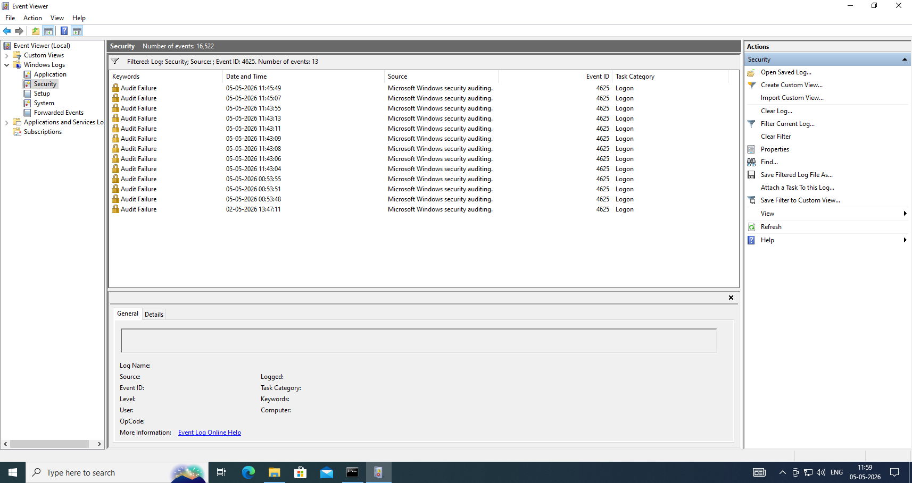

# 🔐 Brute Force Attack Detection using Splunk SIEM

## 📌 Project Overview
This project demonstrates the detection of brute force login attempts using Splunk SIEM by analyzing Windows Security logs. Multiple failed login attempts were simulated on a Windows system and monitored through Splunk to identify suspicious activity.

---
## 🎯 Objective
- Simulate brute force attack behavior  
- Analyze Windows Event Logs (Event ID 4625)  
- Detect suspicious login attempts using Splunk queries  

---
## 🛠️ Tools & Technologies
- Windows 10 (Target System)  
- Splunk Enterprise (SIEM)  
- VMware Workstation  
- Event Viewer  

---
## ⚙️ Lab Setup
- Windows machine used to generate security logs  
- Ubuntu machine running Splunk Enterprise  
- Logs exported from Windows and ingested into Splunk  

---
## 🚀 Steps Performed

### 1️⃣ Attack Simulation
- Created a test user account  
- Performed multiple failed login attempts  
- Generated Event ID 4625 (Failed Login) logs  

---
### 2️⃣ Log Collection
- Accessed Windows Event Viewer  
- Exported Security logs (.csv format)  

---
### 3️⃣ Log Ingestion in Splunk
- Uploaded log file into Splunk  
- Configured source type and indexed data  

---
### 4️⃣ Detection & Analysis

#### 🔍 Search Query
index=main "4625"

#### 📊 Aggregation Query
index=main "4625" | stats count by host

---
## 📸 Screenshots

### Event Viewer Logs(Event ID 4625)

### Event Viewer Logs Details

### Splunk Search Results

### Splunk Analysis(Stats by Host)

### Splunk Analysis

---
## 🧠 Key Findings
- Multiple failed login attempts were detected  
- Pattern indicates possible brute force attack  
- Splunk successfully identified suspicious behavior  

---
## 💼 Skills Demonstrated
- SIEM Monitoring  
- Log Analysis  
- Incident Detection  
- Basic Threat Hunting  

---
## 🚀 Conclusion
This project demonstrates how a Security Analyst can detect brute force attacks using log analysis in a SIEM platform like Splunk.

---
## 📌 Future Improvements
- Real-time log forwarding using Universal Forwarder  
- Alert creation in Splunk  
- Dashboard visualization  

---
🔥 *This project showcases hands-on SOC Level skills in cybers.

---
## 👨‍💻 Author
Riken Patel
